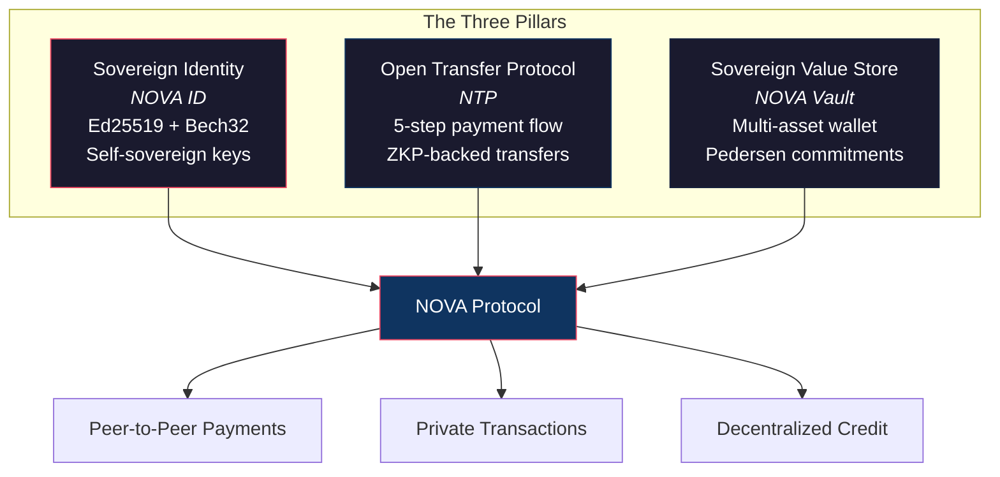
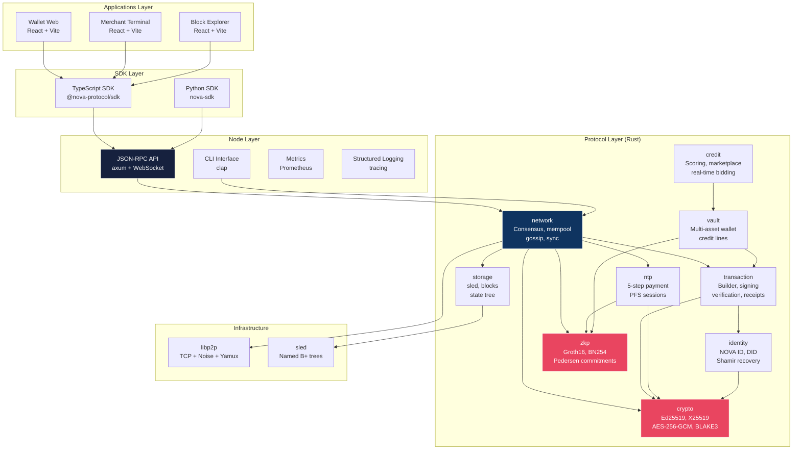
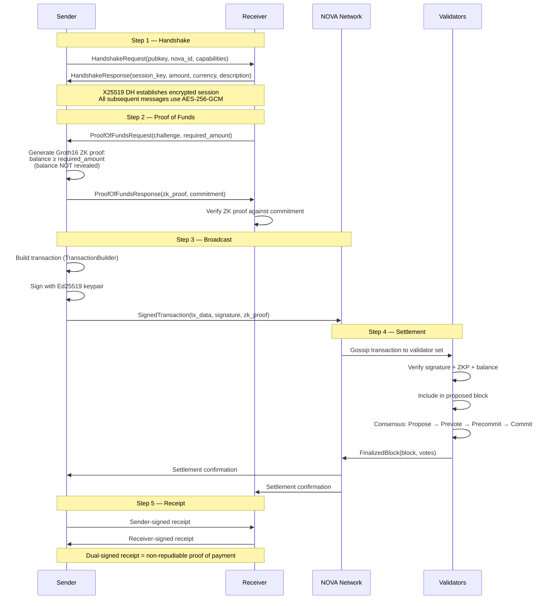
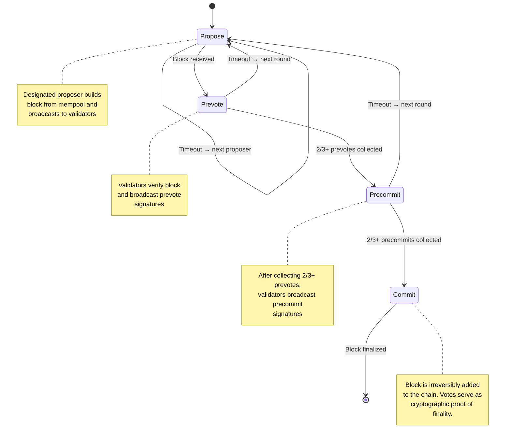
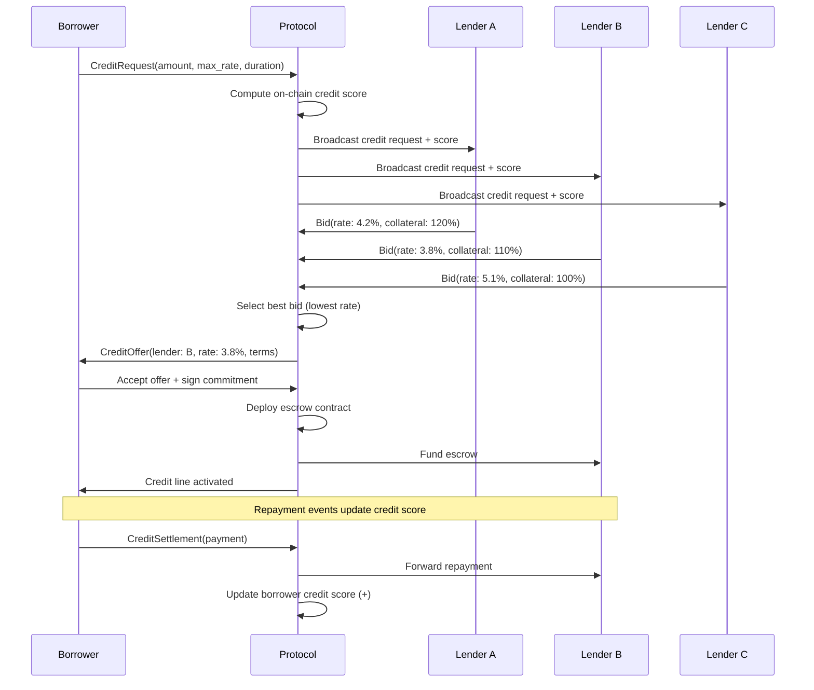

<p align="center">
  <br />
  <br />
  <strong><span style="font-size:48px;">NOVA PROTOCOL</span></strong>
  <br />
  <br />
</p>

<h1 align="center">NOVA Protocol</h1>

<p align="center">
  <strong>The future of payments is peer-to-peer, cryptographic, and open.</strong>
</p>

<p align="center">
  <a href="https://www.rust-lang.org/"></a>
  <a href="LICENSE"></a>
  <a href="https://github.com/alissonlinneker/nova-protocol/actions"></a>
  <a href="https://codecov.io/gh/alissonlinneker/nova-protocol"></a>
</p>

<br />

---

## Why NOVA Exists

The global payments stack is a monument to accidental complexity. A single tap-to-pay coffee purchase passes through a terminal manufacturer, an acquirer, a payment gateway, a card network (Visa, Mastercard), the issuing bank, the receiving bank, and at least two compliance layers -- all before the merchant sees a cent. Each intermediary extracts a fee. Each adds latency. Each introduces a point of failure. And every one of them has access to your transaction data.

We built NOVA because we believe this architecture is not just inefficient -- it is fundamentally obsolete. Credit cards were designed in the 1950s for a world where identity was a plastic card and trust required a central authority. We live in a different world now. Cryptographic signatures can prove identity without a central registry. Zero-knowledge proofs can verify solvency without exposing balances. Peer-to-peer networks can settle transactions without intermediaries. The technology exists. What was missing was a protocol that assembles these primitives into a coherent payment system that real people and real businesses can actually use.

NOVA replaces the entire stack -- card networks, acquirers, gateways, and the interchange fee apparatus -- with a single open protocol. No more 2.9% + $0.30 per transaction. No more 3-day settlement windows. No more chargebacks initiated by someone who simply changed their mind. NOVA transactions are final, private by default, and settle in under two seconds. The sender proves they have the funds using a zero-knowledge proof. The receiver gets cryptographic certainty, not a promise from a bank. This is not a "blockchain for payments." This is a payment protocol that happens to use a blockchain where it makes sense, and cryptography everywhere else.

---

## The Three Pillars

NOVA is built on three foundational primitives. Every feature in the protocol traces back to one of these pillars. If you understand these three concepts, you understand NOVA.

### 1. Sovereign Identity -- NOVA ID

Every participant on the network is identified by an Ed25519 keypair. From the public key, we derive a Bech32-encoded address (the NOVA ID) that is human-readable, checksummed, and practically impossible to fat-finger. Your NOVA ID is yours. Not your bank's. Not a platform's. Yours.

- **Keypair**: Ed25519 signing key (RFC 8032). 32-byte secret, 32-byte public.
- **Address**: Bech32-encoded with `nova` prefix (mainnet), `tnova` (testnet), or `dnova` (devnet).
- **Recovery**: Shamir's Secret Sharing over GF(256) -- split your seed across trusted parties.
- **DID**: W3C Decentralized Identifier compatibility (`did:nova:`).

### 2. Open Transfer Protocol -- NTP

The NOVA Transfer Protocol defines a 5-step payment flow that works for everything from coffee purchases to cross-border remittances. Every step is cryptographically verified. There is no "trust me" phase.

1. **Handshake** -- Devices exchange public keys, establish an encrypted session via X25519 DH.
2. **Proof of Funds** -- Sender generates a Groth16 zero-knowledge proof: "I have enough" without revealing how much.
3. **Broadcast** -- Signed transaction is submitted to the NOVA network.
4. **Settlement** -- Validators verify, include in a block, finalize with BFT consensus.
5. **Receipt** -- Both parties sign a dual-signature receipt. Non-repudiable proof of payment.

### 3. Sovereign Value Store -- NOVA Vault

The NOVA Vault is a multi-asset wallet where every balance carries a Pedersen commitment. Even when operating in "transparent mode," the commitment infrastructure is in place so any wallet can transition to private mode without re-initialization. The vault natively supports fiat-pegged stablecoins, protocol-native NOVA tokens, and arbitrary custom tokens.



---

## Architecture Overview

NOVA is a layered system. The protocol library defines the rules. The node enforces them. The SDKs make them accessible. The apps make them usable. Each layer depends only on the layer below it -- never sideways, never upward.



---

## NTP Payment Flow

This is the full 5-step sequence for a NOVA payment. Every arrow is a cryptographic operation. There are no "handshake acknowledged" steps that rely on good faith -- every message either verifies or the protocol aborts.



---

## Quick Start

### Prerequisites

- **Rust** 1.75+ (install via [rustup](https://rustup.rs))
- **Node.js** 20+ (for TypeScript SDK and web apps)
- **Python** 3.10+ (for Python SDK)
- **Docker** and **Docker Compose** (for local devnet)

### Build from Source

```bash
# Clone the repository
git clone https://github.com/alissonlinneker/nova-protocol.git
cd nova-protocol

# Install development tools and dependencies
make dev-setup

# Build the entire workspace
make build

# Run the test suite
make test
```

### Start a Local Devnet

The fastest way to get a running network is with Docker Compose. This spins up 4 validator nodes, an API gateway, and a block explorer.

```bash
# Build and start the devnet
make docker-build
make docker-up

# Verify everything is running
curl http://localhost:8090/health
# {"status":"ok"}

# Check network status
curl http://localhost:8090/status
# {"version":"0.1.0","network":"devnet","block_height":42,"peer_count":3,"synced":true,...}

# Watch the logs
make docker-logs

# Tear it down when you're done
make docker-down
```

### Send Your First Transaction

Once the devnet is running, you can submit a transaction via the JSON-RPC API:

```bash
# Fund test accounts (devnet only)
make fund-accounts

# Send a transaction via JSON-RPC
curl -X POST http://localhost:8090/rpc \
  -H "Content-Type: application/json" \
  -d '{
    "jsonrpc": "2.0",
    "method": "nova_sendTransaction",
    "params": [{
      "sender": "dnova1qw508d6qejxtdg4y5r3zarvary0c5xw7kxpjzsx",
      "receiver": "dnova1grw3jnv2e4e6a3rxnpfnazs7dwq3rj0qg9c7st",
      "amount": 100000000,
      "currency": "NOVA",
      "fee": 1000
    }],
    "id": 1
  }'
```

---

## Code Examples

### Rust -- Generate Identity and Send a Payment

```rust
use nova_protocol::crypto::keys::NovaKeypair;
use nova_protocol::identity::NovaId;
use nova_protocol::transaction::{TransactionBuilder, TransactionType};
use nova_protocol::transaction::types::{Amount, Currency};

fn main() {
    // Generate a new Ed25519 keypair
    let keypair = NovaKeypair::generate();
    let nova_id = NovaId::from_public_key(&keypair.public_key());

    // Your NOVA address -- share this freely
    println!("Address: {}", nova_id.to_address()); // nova1qw508d6...

    // Build an unsigned transaction
    let tx = TransactionBuilder::new()
        .tx_type(TransactionType::Transfer)
        .sender(nova_id.to_address())
        .receiver("nova1grw3jnv2e4e6a3rxnpfnazs7dwq3rj0qg9c7st".to_string())
        .amount(Amount::new(500_000_000, Currency::NOVA)) // 5.00000000 NOVA
        .fee(1_000) // 0.00001000 NOVA
        .nonce(0)
        .build()
        .expect("transaction construction must succeed");

    println!("Transaction ID: {}", tx.id);
    println!("Amount: {}", tx.amount.display_decimal());

    // Sign the transaction
    let signed_tx = nova_protocol::transaction::sign_transaction(tx, &keypair)
        .expect("signing must succeed");

    println!("Signature: {}", signed_tx.signature.unwrap());
}
```

### Rust -- Zero-Knowledge Balance Proof

```rust
use nova_protocol::zkp::{BalanceProver, BalanceVerifier, commitment};
use ark_bn254::Fr;
use ark_std::test_rng;
use ark_ff::UniformRand;

fn main() {
    let mut rng = test_rng();

    // Trusted setup (in production, use MPC-generated SRS)
    let (prover, verifier) = BalanceProver::setup(&mut rng);
    let params = prover.pedersen_params();

    // Prover knows: balance = 10,000 photons, blinding = random
    let balance: u64 = 10_000;
    let blinding = Fr::rand(&mut rng);
    let commitment = commitment::commit(params, balance, blinding);

    // Prove that balance >= 5,000 WITHOUT revealing balance
    let proof = prover
        .prove(balance, blinding, 5_000, params, &commitment)
        .expect("proof generation must succeed");

    // Verifier checks the proof -- learns nothing about actual balance
    let valid = verifier
        .verify(&proof, &commitment, 5_000, params)
        .expect("verification must not error");

    assert!(valid);
    println!("Balance proof verified: sufficient funds confirmed");
    println!("Proof size: {} bytes", proof.to_bytes().len());
}
```

### TypeScript SDK -- Generate Identity and Send Payment

```typescript
import {
  generateKeypair,
  createNovaId,
  NovaClient,
  TransactionBuilder,
} from '@nova-protocol/sdk';

// Generate a new identity
const { publicKey, secretKey } = await generateKeypair();
const novaId = createNovaId(publicKey);

console.log(`NOVA ID: ${novaId.address}`); // nova1qw508d6...

// Connect to a NOVA node
const client = new NovaClient('http://localhost:8090');

// Check balance
const balance = await client.getBalance(novaId.address);
console.log(`Balance: ${balance.display()} NOVA`);

// Build and send a payment
const tx = new TransactionBuilder()
  .transfer()
  .from(novaId.address)
  .to('nova1grw3jnv2e4e6a3rxnpfnazs7dwq3rj0qg9c7st')
  .amount(500_000_000n, 'NOVA') // 5.0 NOVA
  .fee(1_000n)
  .build();

const signedTx = tx.sign(secretKey);
const receipt = await client.sendTransaction(signedTx);

console.log(`Transaction ${receipt.hash} confirmed at block ${receipt.blockHeight}`);
```

### TypeScript SDK -- Subscribe to Live Events

```typescript
import { NovaClient } from '@nova-protocol/sdk';

const client = new NovaClient('http://localhost:8090');

// Subscribe to new blocks via WebSocket
client.onBlock((block) => {
  console.log(`Block #${block.height} | ${block.txCount} txs | ${block.hash}`);
});

// Subscribe to transactions for a specific address
client.onTransaction('nova1qw508d6...', (tx) => {
  console.log(`Received ${tx.amount.display()} from ${tx.sender}`);
});
```

### Python SDK -- Create Wallet and Check Balance

```python
import asyncio
from nova_sdk import NovaWallet, NovaClient

async def main():
    # Create a new wallet (generates keypair internally)
    wallet = NovaWallet.create()
    print(f"Address: {wallet.address}")    # nova1qw508d6...
    print(f"Public Key: {wallet.public_key_hex}")

    # Connect to a NOVA node
    client = NovaClient("http://localhost:8090")

    # Check balance
    balance = await client.get_balance(wallet.address)
    print(f"Balance: {balance.display()} NOVA")

    # Send a payment
    receipt = await client.send_payment(
        wallet=wallet,
        to="nova1grw3jnv2e4e6a3rxnpfnazs7dwq3rj0qg9c7st",
        amount=500_000_000,
        currency="NOVA",
    )
    print(f"Payment confirmed: {receipt.tx_hash}")

asyncio.run(main())
```

### Python SDK -- Query Block Explorer Data

```python
import asyncio
from nova_sdk import NovaClient

async def main():
    client = NovaClient("http://localhost:8090")

    # Get the latest block
    status = await client.get_status()
    latest_block = await client.get_block(status.block_height)

    print(f"Block #{latest_block.height}")
    print(f"  Hash: {latest_block.hash}")
    print(f"  Proposer: {latest_block.proposer}")
    print(f"  Transactions: {latest_block.tx_count}")
    print(f"  Timestamp: {latest_block.timestamp}")

    # Look up a transaction by hash
    tx = await client.get_transaction("a1b2c3d4e5f6...")
    print(f"Tx {tx.hash}: {tx.sender} -> {tx.recipient} | {tx.amount} photons")

asyncio.run(main())
```

---

## Project Structure

```
nova-protocol/
├── Cargo.toml                   # Workspace root — defines members and shared deps
├── Cargo.lock                   # Reproducible builds. Commit this.
├── Makefile                     # Build, test, lint, docker — the whole lifecycle
├── LICENSE                      # MIT — because open means open
├── CHANGELOG.md                 # Every release, every change, documented
│
├── protocol/                    # Core protocol library (the brains)
│   ├── Cargo.toml
│   └── src/
│       ├── lib.rs               # Module declarations and crate-level docs
│       ├── config.rs            # Protocol constants — every magic number lives here
│       ├── crypto/              # Cryptographic primitives
│       │   ├── mod.rs           # Re-exports for ergonomic imports
│       │   ├── keys.rs          # Ed25519 keypair generation and management
│       │   ├── signatures.rs    # Sign and verify operations
│       │   ├── hash.rs          # SHA-256, BLAKE3, double-SHA-256, hash-to-field
│       │   ├── encryption.rs    # AES-256-GCM encrypt/decrypt
│       │   └── pfs.rs           # X25519 Perfect Forward Secrecy sessions
│       ├── identity/            # Sovereign identity management
│       │   ├── mod.rs
│       │   ├── keypair.rs       # NovaKeypair, NovaPublicKey, NovaSignature
│       │   ├── nova_id.rs       # Bech32 address derivation and validation
│       │   ├── recovery.rs      # Shamir's Secret Sharing for key recovery
│       │   └── did.rs           # W3C DID compatibility (did:nova:)
│       ├── transaction/         # Transaction construction and lifecycle
│       │   ├── mod.rs
│       │   ├── types.rs         # TransactionType, Amount, Currency enums
│       │   ├── builder.rs       # Fluent TransactionBuilder pattern
│       │   ├── signing.rs       # Ed25519 transaction signing
│       │   ├── verification.rs  # Structural + cryptographic verification
│       │   └── receipt.rs       # Immutable post-confirmation receipts
│       ├── zkp/                 # Zero-knowledge proofs
│       │   ├── mod.rs
│       │   ├── commitment.rs    # Pedersen commitment scheme
│       │   ├── circuit.rs       # R1CS arithmetic circuit (BalanceProofCircuit)
│       │   ├── prover.rs        # Groth16 proof generation
│       │   └── verifier.rs      # Groth16 proof verification
│       ├── vault/               # Multi-asset wallet and value management
│       │   ├── mod.rs
│       │   ├── token.rs         # Token identifiers, metadata, standards
│       │   ├── balance.rs       # Per-wallet balance tracking with commitments
│       │   ├── wallet.rs        # Multi-asset wallet operations
│       │   └── credit.rs        # Credit line lifecycle management
│       ├── ntp/                 # NOVA Transfer Protocol
│       │   ├── mod.rs
│       │   ├── handshake.rs     # Step 1: Key exchange and session setup
│       │   ├── proof_request.rs # Step 2: ZK proof of funds challenge
│       │   ├── broadcast.rs     # Step 3: Transaction broadcast
│       │   ├── settlement.rs    # Step 4: Validator settlement
│       │   ├── receipt.rs       # Step 5: Dual-signed payment receipt
│       │   └── error.rs         # NTP-specific error types
│       ├── network/             # P2P networking and consensus
│       │   ├── mod.rs
│       │   ├── node.rs          # Validator node lifecycle
│       │   ├── consensus.rs     # Hybrid PoS+PoA consensus engine
│       │   ├── mempool.rs       # Priority transaction pool
│       │   ├── producer.rs       # Block production pipeline
│       │   ├── consensus_loop.rs # Async consensus-driven block loop
│       │   ├── gossip.rs        # Gossip protocol for propagation
│       │   ├── rpc.rs           # JSON-RPC type definitions
│       │   └── sync.rs          # Chain state synchronization
│       ├── storage/             # Persistent storage
│       │   ├── mod.rs
│       │   ├── block.rs         # Block structure and hash operations
│       │   ├── chain.rs         # In-memory chain with validation
│       │   ├── state.rs         # Sparse Merkle Tree for account state
│       │   └── db.rs            # sled persistence layer
│       └── credit/              # Credit scoring and marketplace
│           └── mod.rs
│   └── tests/
│       └── e2e.rs               # End-to-end integration tests
│
├── node/                        # Standalone validator node binary
│   ├── Cargo.toml
│   └── src/
│       ├── main.rs              # Entry point — wires everything together
│       ├── lib.rs               # Module declarations
│       ├── api.rs               # axum router, JSON-RPC gateway, WebSocket
│       ├── cli.rs               # Command-line argument parsing (clap)
│       ├── logging.rs           # Structured logging setup (tracing)
│       └── metrics.rs           # Prometheus metric definitions
│
├── contracts/                   # On-chain smart contracts
│   ├── Cargo.toml
│   └── src/
│       └── ...                  # Credit escrow, dispute resolution, token factory
│
├── sdk/
│   ├── typescript/              # TypeScript SDK
│   │   ├── package.json
│   │   ├── tsconfig.json
│   │   ├── src/                 # Client, identity, transactions, types
│   │   ├── dist/                # Compiled output
│   │   └── tests/               # Vitest test suite
│   └── python/                  # Python SDK
│       ├── pyproject.toml
│       ├── nova_sdk/            # Client, wallet, models
│       └── tests/               # pytest test suite
│
├── apps/
│   ├── wallet-web/              # Consumer wallet (React + Vite + Tailwind)
│   ├── merchant-terminal/       # Merchant payment terminal
│   └── explorer/                # Block explorer
│
├── docker/
│   ├── Dockerfile.node          # Multi-stage build for validator node
│   ├── Dockerfile.api           # Multi-stage build for API gateway
│   └── docker-compose.yml       # 4-node devnet + API + explorer
│
├── scripts/
│   ├── setup-devnet.sh          # Bootstrap a local development network
│   ├── generate-genesis.sh      # Generate genesis block configuration
│   ├── fund-test-accounts.sh    # Seed devnet accounts with test funds
│   └── benchmark.sh             # Run performance benchmarks
│
└── .github/
    └── workflows/               # CI/CD pipelines
        └── ci.yml               # Lint, test, build, security audit, release
```

---

## Modules Deep Dive

### `crypto` -- Cryptographic Primitives

The foundation of everything security-related. We chose boring, well-audited cryptography on purpose. No novel constructions, no "we improved on AES," no cryptographic machismo. Just battle-tested primitives wrapped in type-safe Rust.

| File | Purpose |
|------|---------|
| `keys.rs` | Ed25519 keypair generation, serialization, hex/bytes conversion |
| `signatures.rs` | Sign and verify operations with timing-safe comparison |
| `hash.rs` | SHA-256 (compatibility), BLAKE3 (performance), double-SHA-256 (tx IDs), hash-to-field (ZKP) |
| `encryption.rs` | AES-256-GCM authenticated encryption with 96-bit nonces |
| `pfs.rs` | X25519 Diffie-Hellman for Perfect Forward Secrecy sessions |

**Design opinion**: We use `ed25519-dalek` because it is RFC 8032 compliant and resistant to side-channel attacks. We use BLAKE3 over SHA-256 for internal hashing because it is faster on every architecture that matters. SHA-256 is reserved for interoperability with systems that expect it.

### `identity` -- Sovereign Identity

Your keys, your identity, your money. No custodian, no KYC provider, no central registry sits between you and your NOVA ID.

| File | Purpose |
|------|---------|
| `keypair.rs` | `NovaKeypair`, `NovaPublicKey`, `NovaSignature` -- the identity primitives |
| `nova_id.rs` | Bech32 address derivation with `nova`/`tnova`/`dnova` prefixes |
| `recovery.rs` | Shamir's Secret Sharing over GF(256) for social key recovery |
| `did.rs` | W3C Decentralized Identifier interop (`did:nova:` method) |

**Design opinion**: Bech32 (not Bech32m) for addresses because we are encoding raw pubkey hashes, not segwit witness programs. The error-detection properties are sufficient for our use case, and the encoding produces addresses that are unambiguously NOVA.

### `transaction` -- Transaction Lifecycle

Every value transfer on the network is a `Transaction`. The builder pattern enforces correct construction. Signing is a separate step (because you should be able to build transactions without key material, and test them without signing).

| File | Purpose |
|------|---------|
| `types.rs` | `TransactionType`, `Amount`, `Currency` -- the vocabulary of payments |
| `builder.rs` | Fluent `TransactionBuilder` with deterministic ID computation |
| `signing.rs` | Ed25519 signing over canonical byte representation |
| `verification.rs` | Structural validation + cryptographic signature verification |
| `receipt.rs` | Immutable post-confirmation receipts for audit trails |

**Design opinion**: All amounts are `u64` in the smallest denomination. There is no floating-point arithmetic anywhere near monetary values. The `decimals` field on currencies is for display only. The protocol never divides.

### `zkp` -- Zero-Knowledge Proofs

The privacy engine. Groth16 proofs over BN254 let a sender prove "I have enough" without revealing how much "enough" actually is. The proof is 192 bytes. Verification takes about 2ms. That is the entire privacy story -- no mixing, no shielded pools, no trusted third parties.

| File | Purpose |
|------|---------|
| `commitment.rs` | Pedersen commitment scheme: setup, commit, verify opening |
| `circuit.rs` | R1CS arithmetic circuit (`BalanceProofCircuit`) with 64-bit range check |
| `prover.rs` | Groth16 proof generation via arkworks |
| `verifier.rs` | Groth16 proof verification |

**Design opinion**: We chose BN254 over BLS12-381 because Ethereum precompiles exist for BN254, and cross-chain interoperability matters more to us than the marginal security improvement of a larger curve. The arkworks ecosystem gives us a mature, well-tested Groth16 implementation.

### `vault` -- Multi-Asset Wallet

Where money lives. Every on-chain balance, credit line, and token position passes through the vault. The circulatory system of NOVA.

| File | Purpose |
|------|---------|
| `token.rs` | Token identifiers, metadata, type system, pre-defined tokens |
| `balance.rs` | Per-wallet balance tracking with Pedersen commitments |
| `wallet.rs` | Multi-asset wallet: deposits, withdrawals, transfers |
| `credit.rs` | Credit line lifecycle: limits, draws, repayments, status machine |

**Design opinion**: Credit lines are first-class citizens, not an afterthought bolted onto transfers. They have their own lifecycle, rate model, and state machine. This is deliberate -- the entire thesis of NOVA is that credit infrastructure belongs in the protocol, not in a bank's proprietary system.

### `ntp` -- NOVA Transfer Protocol

The 5-step payment flow. Every coffee purchase, every cross-border remittance, every B2B invoice settlement follows this protocol. Encryption is mandatory after the handshake. Perfect Forward Secrecy means compromising a long-term key does not reveal past session traffic.

| File | Purpose |
|------|---------|
| `handshake.rs` | X25519 key exchange, session establishment, payment params |
| `proof_request.rs` | ZK proof-of-funds challenge and response |
| `broadcast.rs` | Signed transaction broadcast to the network |
| `settlement.rs` | Validator settlement and confirmation propagation |
| `receipt.rs` | Dual-signed payment receipt generation |
| `error.rs` | NTP-specific error types |

### `network` -- P2P Networking and Consensus

The distributed systems layer. Handles everything from peer discovery to block finalization. The mempool is protected by `parking_lot::RwLock` because reads vastly outnumber writes on the hot path, and we want zero-cost reads during block production.

| File | Purpose |
|------|---------|
| `node.rs` | Validator node lifecycle, peer management, startup/shutdown |
| `consensus.rs` | Hybrid PoS+PoA consensus engine with BFT finality |
| `mempool.rs` | Priority-ordered transaction pool with thread-safe access |
| `producer.rs` | Block production pipeline |
| `consensus_loop.rs` | Async consensus-driven block loop |
| `gossip.rs` | Gossip protocol with BLAKE3 deduplication and bounded TTL |
| `rpc.rs` | JSON-RPC method definitions (transport-agnostic) |
| `sync.rs` | Chain state synchronization between peers |

### `storage` -- Persistent Storage

The data layer. sled with named B+ trees for blocks, state, transactions, and receipts. Bincode for on-disk serialization (compact, fast, deterministic). JSON is for APIs; bincode is for storage.

| File | Purpose |
|------|---------|
| `block.rs` | Block structure, genesis block, BLAKE3 hash computation |
| `chain.rs` | In-memory chain management with hash-chain validation |
| `state.rs` | Sparse Merkle Tree (256-bit keyspace, BLAKE3) for account state |
| `db.rs` | sled persistence with named B+ trees and atomic batch writes |

### `credit` -- Credit Marketplace

On-chain credit scoring and decentralized lending. This is the part that makes NOVA more than just another payment rail -- it is a full financial protocol.

---

## Zero-Knowledge Proofs

### Why ZKPs Matter for Payments

Every time you tap your credit card, the merchant learns your card number, expiration date, and (through the acquirer) your approximate balance and spending patterns. Every intermediary in the chain has access to your transaction history. This is not a privacy model -- it is surveillance infrastructure monetized as "fraud prevention."

NOVA takes a fundamentally different approach. When you pay someone, they learn exactly one thing: that you have enough funds to cover the transaction. Not your balance. Not your other transactions. Not your spending patterns. Just "sufficient funds: yes or no."

### How It Works: Groth16 Balance Proofs

The zero-knowledge proof system uses Groth16 over the BN254 (alt_bn128) elliptic curve. Here is the protocol:

1. **Commitment**: The sender's balance is hidden behind a Pedersen commitment: `C = balance * G + r * H`, where `G` and `H` are generator points on BN254/G1, and `r` is a random blinding factor.

2. **Circuit**: The `BalanceProofCircuit` is an R1CS arithmetic circuit that enforces:
   - The prover knows `(balance, r)` such that `C = balance * G + r * H`
   - `balance >= required_amount` (enforced via 64-bit range decomposition)
   - Every bit of the decomposition is boolean (0 or 1) -- no overflow, no wrap-around

3. **Proof Generation**: The prover runs the Groth16 proving algorithm to generate a succinct proof (~192 bytes) that the circuit is satisfied.

4. **Verification**: The verifier checks the proof against the public inputs (commitment and required amount). Verification takes ~2ms and reveals nothing about the actual balance.

### Security Properties

| Property | Guarantee |
|----------|-----------|
| **Hiding** | Information-theoretically hiding under the DLOG assumption on BN254 |
| **Binding** | Computationally binding under DLOG -- cannot open a commitment to two different values |
| **Soundness** | Groth16 knowledge-soundness in the generic group model |
| **Zero-Knowledge** | The verifier learns nothing beyond the truth of the statement |
| **Range Safety** | 64-bit decomposition with boolean enforcement on every limb |

### Trusted Setup

The current implementation uses a local trusted setup (per-circuit CRS generation). For mainnet, this will be replaced with an MPC ceremony where multiple independent participants contribute randomness. As long as at least one participant is honest and destroys their toxic waste, the setup is secure. We will publish the ceremony tooling and transcript for public verification.

---

## Consensus Mechanism

### Hybrid PoS + PoA with BFT Finality

NOVA uses a hybrid consensus mechanism that combines the economic security of Proof-of-Stake with the operational efficiency of Proof-of-Authority. This is not a compromise -- it is a deliberate design choice that optimizes for the properties that actually matter in a payment network: fast finality, deterministic block times, and resistance to censorship.

### How It Works

**Proposer Selection (PoS)**

Validators are sorted by stake. Block production rotates round-robin among the top `max_validators` stakers. Higher stake means you get a slot sooner, but everyone in the active set gets their turn. No grinding, no VRF lottery -- deterministic and auditable.

```
Minimum stake:    10 NOVA (1,000,000,000 photons)
Max validators:   100
Epoch length:     100 blocks
```

**Block Signing (PoA)**

Only validators in the active authority set can sign blocks. The authority set is updated at epoch boundaries (every 100 blocks) based on the current stake distribution.

**BFT Finality**

A block is finalized when 2/3 + 1 of the active validator set has voted for it. This follows the standard PBFT quorum threshold. Once finalized, a block is irreversible -- there is no "6 confirmations" ambiguity.

### Consensus Round State Machine



### Finality Properties

| Property | Value |
|----------|-------|
| Block time | 2 seconds |
| Finality | Single block (no probabilistic confirmation) |
| Byzantine fault tolerance | Up to 1/3 of validators |
| Liveness | Guaranteed when > 2/3 of validators are honest and online |
| Proposer timeout | 5 seconds before round advance |

---

## Credit Marketplace

The credit marketplace is what separates NOVA from every other payment protocol. Most blockchain projects treat credit as an afterthought -- "just use DeFi." We disagree. Credit is foundational to economic activity, and it deserves first-class protocol support.

### On-Chain Credit Scoring

Every NOVA address accumulates a credit profile based on verifiable on-chain activity:

- **Repayment history**: Timely repayment of previous credit lines.
- **Transaction volume**: Consistent economic activity over time.
- **Stake participation**: Validators and stakers demonstrate long-term commitment.
- **Account age**: Sybil resistance through time-weighted reputation.

The scoring model is deterministic and transparent. No black-box algorithms, no opaque bureau decisions. Your score is computed from public on-chain data that you can audit yourself.

### Real-Time Credit Bidding

Credit originators (liquidity providers) bid on credit requests in real-time:



### Credit Line Lifecycle

Credit lines in NOVA have a well-defined state machine:

| State | Description |
|-------|-------------|
| `Requested` | Borrower has submitted a credit request |
| `Bidding` | Lenders are submitting competitive bids |
| `Offered` | Best bid selected, awaiting borrower acceptance |
| `Active` | Credit line is open and drawable |
| `Drawing` | Funds are being drawn from the credit line |
| `Repaying` | Borrower is making repayments |
| `Settled` | All obligations fulfilled, credit line closed |
| `Defaulted` | Repayment obligations not met, collateral liquidated |

---

## Performance

### Target Metrics

These are not theoretical numbers. These are the targets we are engineering toward, validated against our benchmark suite.

| Metric | Target | Notes |
|--------|--------|-------|
| **Transaction throughput** | 10,000 TPS | Sustained, not burst |
| **Block time** | 2 seconds | Deterministic, not average |
| **Finality** | < 2 seconds | Single-block BFT finality |
| **ZK proof generation** | < 500ms | Groth16 on commodity hardware |
| **ZK proof verification** | < 2ms | Batch-verifiable |
| **ZK proof size** | 192 bytes | Groth16 over BN254 |
| **Ed25519 signing** | < 50us | Per transaction |
| **Ed25519 verification** | < 100us | Per transaction, batch-optimizable |
| **Transaction size** | ~300 bytes | Base transfer without ZKP |
| **State tree proof** | < 1KB | Merkle inclusion proof |
| **P2P gossip latency** | < 200ms | 95th percentile across validator set |

### Running Benchmarks

```bash
# Full benchmark suite
make bench

# Specific benchmarks
make bench-signing     # Ed25519 sign/verify throughput
make bench-zkp         # Groth16 prove/verify latency
make bench-consensus   # Block production and finalization

# Network benchmark (requires running devnet)
./scripts/benchmark.sh
```

---

## Security

### Cryptographic Stack

NOVA's security is not a feature -- it is the architecture. Every layer of the protocol is built on well-understood, audited cryptographic primitives.

| Layer | Primitive | Specification | Purpose |
|-------|-----------|---------------|---------|
| **Signatures** | Ed25519 | RFC 8032 | Transaction authorization, block signing, vote authentication |
| **Key Exchange** | X25519 | RFC 7748 | Ephemeral session keys for NTP handshakes |
| **Encryption** | AES-256-GCM | NIST SP 800-38D | Symmetric encryption of NTP session traffic |
| **Hashing** | BLAKE3 | — | Transaction IDs, Merkle roots, block hashes, gossip dedup |
| **Hashing (compat)** | SHA-256 | FIPS 180-4 | Cross-system interoperability |
| **ZK Proofs** | Groth16 | [Groth16] | Balance proofs for private transactions |
| **Commitments** | Pedersen | — | Balance hiding with information-theoretic security |
| **Curve (ZKP)** | BN254 | — | Groth16 pairing-friendly curve |
| **Recovery** | Shamir's SS | — | Social key recovery via secret sharing over GF(256) |

### Perfect Forward Secrecy

Every NTP session uses ephemeral X25519 key pairs for the Diffie-Hellman exchange. This means:

- Compromising a long-term Ed25519 key does **not** reveal past session traffic.
- Each session has a unique shared secret derived from fresh ephemeral keys.
- Session keys are never written to disk or transmitted in the clear.

### No Shared Secrets Architecture

There is no central key vault. There is no HSM that, if compromised, breaks the entire system. Each participant holds their own Ed25519 signing key. The protocol never requires two parties to share a secret -- only to prove they possess their own.

### Threat Model

| Threat | Mitigation |
|--------|------------|
| **Key theft** | Shamir's Secret Sharing for recovery; no central key store |
| **Replay attacks** | Per-sender nonce + transaction expiry window (5 min) |
| **Balance exposure** | Groth16 ZK proofs; verifier learns nothing about actual balance |
| **Man-in-the-middle** | X25519 ephemeral DH with identity-bound session keys |
| **Transaction malleability** | Double-SHA-256 IDs computed over canonical representation excluding signature |
| **Eclipse attacks** | Minimum peer threshold (3) for consensus participation |
| **Sybil attacks** | Minimum stake requirement (10 NOVA) for validator set entry |
| **Clock manipulation** | NTP sync every 60s; max 500ms clock skew tolerance |

### Audit Plan

- **Phase 1** (Pre-testnet): Internal security review + static analysis (cargo-audit, clippy, miri).
- **Phase 2** (Pre-mainnet): Independent third-party audit of cryptographic modules, consensus engine, and smart contracts.
- **Phase 3** (Post-mainnet): Ongoing bug bounty program. Continuous fuzzing with cargo-fuzz.

---

## Network Configuration

NOVA operates three networks, each with its own address prefix and chain ID:

| Network | Chain ID | Address Prefix | Purpose |
|---------|----------|----------------|---------|
| **Mainnet** | `0x4E4F5641` ("NOVA") | `nova` | Production. Real value. Real consequences. |
| **Testnet** | `0x4E4F5654` ("NOVT") | `tnova` | Public test network. Tokens have no value. |
| **Devnet** | `0x4E4F5644` ("NOVD") | `dnova` | Local development. Reset weekly. No promises. |

### Default Ports

| Service | Port | Description |
|---------|------|-------------|
| P2P | `9740` | Validator-to-validator gossip and sync |
| RPC API | `9741` | JSON-RPC and REST endpoints |
| Metrics | `9742` | Prometheus-compatible metrics endpoint |

### Node Configuration (Environment Variables)

```bash
# Node identity
NOVA_NODE_ID="my-validator-01"

# Network addresses
NOVA_P2P_ADDR="0.0.0.0:9740"
NOVA_RPC_ADDR="0.0.0.0:9741"
NOVA_METRICS_ADDR="0.0.0.0:9742"

# Peer discovery
NOVA_BOOT_NODES="node1.novaprotocol.io:9740,node2.novaprotocol.io:9740"
NOVA_VALIDATORS="validator1:9740,validator2:9740,validator3:9740,validator4:9740"

# Storage
NOVA_DATA_DIR="/var/lib/nova"
NOVA_GENESIS_PATH="/etc/nova/genesis.json"

# Logging
NOVA_LOG_LEVEL="info"     # trace, debug, info, warn, error
RUST_LOG="info"            # Rust-level log filter
```

---

## Docker

### Local Devnet with Docker Compose

The Docker setup provides a complete local development environment: 4 validator nodes, an API gateway, and a block explorer.

```bash
# Build images
docker compose -f docker/docker-compose.yml build

# Start the devnet
docker compose -f docker/docker-compose.yml up -d

# Check service health
docker compose -f docker/docker-compose.yml ps

# Stream logs from all services
docker compose -f docker/docker-compose.yml logs -f

# Stream logs from a specific node
docker compose -f docker/docker-compose.yml logs -f nova-node-1

# Stop everything
docker compose -f docker/docker-compose.yml down

# Stop and wipe all data (full reset)
docker compose -f docker/docker-compose.yml down -v
```

### Service Endpoints (Devnet)

| Service | Endpoint | Description |
|---------|----------|-------------|
| Node 1 RPC | `http://localhost:8080` | Validator node 1 |
| Node 2 RPC | `http://localhost:8081` | Validator node 2 |
| Node 3 RPC | `http://localhost:8082` | Validator node 3 |
| Node 4 RPC | `http://localhost:8083` | Validator node 4 |
| API Gateway | `http://localhost:8090` | Load-balanced API (use this) |
| Block Explorer | `http://localhost:3000` | Web-based block explorer |
| Metrics (Node 1) | `http://localhost:9100` | Prometheus metrics |

### Custom Dockerfile

If you want to run a single node outside of Docker Compose:

```bash
# Build the node image
docker build -f docker/Dockerfile.node -t nova-node .

# Run a standalone node
docker run -d \
  --name nova-standalone \
  -p 9740:9090 \
  -p 9741:8080 \
  -p 9742:9100 \
  -e NOVA_NODE_ID="standalone" \
  -e NOVA_LOG_LEVEL="debug" \
  -v nova-data:/data \
  nova-node
```

---

## API Reference

### JSON-RPC Methods

All JSON-RPC requests are sent via `POST /rpc` with `Content-Type: application/json`.

#### `nova_blockHeight`

Returns the latest finalized block height.

```json
// Request
{
  "jsonrpc": "2.0",
  "method": "nova_blockHeight",
  "params": [],
  "id": 1
}

// Response
{
  "jsonrpc": "2.0",
  "result": 42,
  "id": 1
}
```

#### `nova_peerCount`

Returns the number of connected P2P peers.

```json
// Request
{
  "jsonrpc": "2.0",
  "method": "nova_peerCount",
  "params": [],
  "id": 1
}

// Response
{
  "jsonrpc": "2.0",
  "result": 3,
  "id": 1
}
```

#### `nova_networkId`

Returns the current network identifier.

```json
// Request
{
  "jsonrpc": "2.0",
  "method": "nova_networkId",
  "params": [],
  "id": 1
}

// Response
{
  "jsonrpc": "2.0",
  "result": "devnet",
  "id": 1
}
```

#### `nova_version`

Returns the node software version.

```json
// Request
{
  "jsonrpc": "2.0",
  "method": "nova_version",
  "params": [],
  "id": 1
}

// Response
{
  "jsonrpc": "2.0",
  "result": "0.1.0",
  "id": 1
}
```

#### `nova_getBlock`

Returns a block by height.

```json
// Request
{
  "jsonrpc": "2.0",
  "method": "nova_getBlock",
  "params": [42],
  "id": 1
}

// Response
{
  "jsonrpc": "2.0",
  "result": {
    "height": 42,
    "hash": "a1b2c3d4...",
    "parent_hash": "e5f6a7b8...",
    "proposer": "c9d0e1f2...",
    "tx_count": 15,
    "timestamp": 1708272000000
  },
  "id": 1
}
```

#### `nova_getTransaction`

Returns a transaction by its hash.

```json
// Request
{
  "jsonrpc": "2.0",
  "method": "nova_getTransaction",
  "params": ["a1b2c3d4e5f6..."],
  "id": 1
}

// Response
{
  "jsonrpc": "2.0",
  "result": {
    "hash": "a1b2c3d4e5f6...",
    "sender": "nova1qw508d6...",
    "recipient": "nova1grw3jnv...",
    "amount": 500000000,
    "fee": 1000,
    "block_height": 42,
    "status": "Confirmed",
    "timestamp": 1708272000000
  },
  "id": 1
}
```

#### `nova_getBalance`

Returns the balance for an address.

```json
// Request
{
  "jsonrpc": "2.0",
  "method": "nova_getBalance",
  "params": ["nova1qw508d6..."],
  "id": 1
}

// Response
{
  "jsonrpc": "2.0",
  "result": {
    "address": "nova1qw508d6...",
    "balance": 10000000000,
    "nonce": 5,
    "tx_count": 23
  },
  "id": 1
}
```

#### `nova_sendTransaction`

Submits a signed transaction to the network.

```json
// Request
{
  "jsonrpc": "2.0",
  "method": "nova_sendTransaction",
  "params": [{
    "sender": "nova1qw508d6...",
    "receiver": "nova1grw3jnv...",
    "amount": 500000000,
    "currency": "NOVA",
    "fee": 1000,
    "nonce": 5,
    "signature": "a1b2c3d4...",
    "sender_public_key": "e5f6a7b8..."
  }],
  "id": 1
}

// Response
{
  "jsonrpc": "2.0",
  "result": {
    "tx_hash": "c9d0e1f2...",
    "status": "Pending"
  },
  "id": 1
}
```

### REST Endpoints

| Method | Path | Description |
|--------|------|-------------|
| `GET` | `/health` | Liveness probe -- returns `{"status": "ok"}` |
| `GET` | `/status` | Node status: version, network, height, peers, sync state |
| `POST` | `/rpc` | JSON-RPC 2.0 gateway (see above) |
| `GET` | `/ws` | WebSocket upgrade for live block and transaction events |
| `GET` | `/validators` | Current validator set with stake and activity info |
| `GET` | `/blocks/:height` | Block by height |
| `GET` | `/transactions/:hash` | Transaction by hash |
| `GET` | `/accounts/:address` | Account state: balance, nonce, transaction count |

### WebSocket Events

Connect to `ws://localhost:8090/ws` to receive real-time events:

```json
// New block finalized
{
  "type": "new_block",
  "height": 43,
  "hash": "a1b2c3d4...",
  "tx_count": 12,
  "timestamp": 1708272002000
}

// New transaction in mempool
{
  "type": "new_transaction",
  "hash": "e5f6a7b8...",
  "sender": "nova1qw508d6...",
  "recipient": "nova1grw3jnv...",
  "amount": 500000000
}
```

---

## SDKs

### TypeScript SDK

The official TypeScript SDK for building applications on NOVA. Full transaction builder, identity management, and real-time event subscriptions.

```bash
# Install
npm install @nova-protocol/sdk

# Or with yarn
yarn add @nova-protocol/sdk
```

**Features**:
- Keypair generation and NOVA ID derivation
- Transaction builder with fluent API
- JSON-RPC client with automatic retry and connection pooling
- WebSocket client for real-time block and transaction events
- Full TypeScript type definitions
- Zero runtime dependencies on native crypto (uses WebCrypto API)

```bash
# Run the SDK test suite
cd sdk/typescript
npm install
npm test
```

### Python SDK

The official Python SDK for building applications on NOVA. Pydantic models, async client, and a batteries-included wallet abstraction.

```bash
# Install
pip install nova-sdk

# Or from source (development mode)
cd sdk/python
pip install -e ".[dev]"
```

**Features**:
- `NovaWallet` class with keypair generation and address derivation
- Async `NovaClient` with `httpx` for JSON-RPC and REST
- Pydantic V2 models for all API types (fully typed, validated)
- Transaction builder with Pythonic API
- Compatible with Python 3.10+

```bash
# Run the SDK test suite
cd sdk/python
python -m pytest tests/ -v
```

---

## Roadmap

### Phase 0 -- Foundation (Current)

- [x] Core protocol library: crypto, identity, transaction, ZKP, vault, NTP
- [x] Groth16 balance proofs over BN254 with arkworks
- [x] Hybrid PoS+PoA consensus engine
- [x] Block production pipeline and async consensus loop
- [x] Standalone validator node with JSON-RPC API
- [x] End-to-end integration test suite
- [x] TypeScript and Python SDKs
- [x] Consumer wallet, merchant terminal, and block explorer apps
- [x] Docker-based 4-node local devnet
- [x] CI/CD pipeline: lint, test, build, security audit

### Phase 1 -- Testnet

- [ ] Public testnet launch with 10+ external validators
- [ ] Faucet for test token distribution
- [ ] MPC trusted setup ceremony for Groth16 CRS
- [ ] Credit marketplace: on-chain scoring and real-time bidding
- [ ] Cross-chain bridge proof-of-concept (EVM compatible)
- [ ] Mobile wallet SDK (React Native)
- [ ] Independent security audit of cryptographic modules

### Phase 2 -- Hardening

- [ ] Formal verification of consensus protocol (TLA+ specification)
- [ ] Fuzzing campaign: transaction parsing, ZKP circuits, consensus engine
- [ ] Light client protocol for resource-constrained devices
- [ ] State pruning and archival node separation
- [ ] Geographic distribution: minimum 3 continents for validator set
- [ ] Load testing at 10,000 TPS sustained for 24 hours

### Phase 3 -- Mainnet

- [ ] Mainnet genesis block
- [ ] Staking portal for validator onboarding
- [ ] Merchant onboarding toolkit and POS integration
- [ ] Fiat on/off ramp partnerships
- [ ] Bug bounty program launch
- [ ] Governance framework for protocol upgrades
- [ ] Credit marketplace mainnet activation

### Phase 4 -- Ecosystem

- [ ] Smart contract platform (WASM-based execution engine)
- [ ] DEX for native token swaps
- [ ] Cross-chain messaging protocol
- [ ] Institutional custody integration
- [ ] SDK ecosystem: Go, Swift, Kotlin
- [ ] Protocol grants program for third-party developers

---

## Development

### Prerequisites

```bash
# Install Rust toolchain
curl --proto '=https' --tlsv1.2 -sSf https://sh.rustup.rs | sh
rustup update stable
rustup component add clippy rustfmt

# Install Node.js 20+ (for TypeScript SDK and web apps)
# Use nvm, fnm, or your preferred version manager

# Install Python 3.10+ (for Python SDK)
# Use pyenv or your system package manager
```

### Common Commands

```bash
# Build
make build                    # Debug build
make release                  # Optimized release build

# Test
make test                     # All Rust tests
make test-protocol            # Protocol library only
make test-node                # Node binary only
make test-sdk-ts              # TypeScript SDK
make test-sdk-py              # Python SDK
make test-all                 # Everything

# Code Quality
make fmt                      # Format all Rust code
make fmt-check                # Check formatting (CI mode)
make lint                     # Clippy with -D warnings

# Benchmarks
make bench                    # Full benchmark suite
make bench-signing            # Ed25519 sign/verify
make bench-zkp                # Groth16 prove/verify
make bench-consensus          # Block production/finalization

# Web Applications
make wallet-dev               # Start wallet dev server
make merchant-dev             # Start merchant terminal dev server
make explorer-dev             # Start block explorer dev server

# Cleanup
make clean                    # Remove all build artifacts
```

---

## Contributing

We welcome contributions from engineers who care about building things right. Whether it is a one-line typo fix or a new consensus optimization, every contribution goes through the same process:

1. Fork the repository.
2. Create a feature branch from `main`.
3. Write your code. Write your tests. Run `make lint && make test`.
4. Open a pull request with a clear description of what and why.
5. Respond to review feedback.

Please read [CONTRIBUTING.md](.github/CONTRIBUTING.md) for the full contribution guidelines, code style expectations, and commit message conventions.

### Where to Start

- Look for issues labeled [`good first issue`](https://github.com/alissonlinneker/nova-protocol/issues?q=label%3A%22good+first+issue%22) -- these are scoped, well-described, and ready for someone to pick up.
- The [`help wanted`](https://github.com/alissonlinneker/nova-protocol/issues?q=label%3A%22help+wanted%22) label marks issues where we would particularly value community input.
- If you are interested in the cryptographic modules, please have experience with elliptic curve cryptography and zero-knowledge proof systems. We will not merge speculative optimizations to security-critical code.

### Code of Conduct

Be professional. Be constructive. Disagree on the merits, not the person. We do not have a 47-page code of conduct because we trust adults to behave like adults.

---

## License

NOVA Protocol is released under the [MIT License](LICENSE).

```
MIT License

Copyright (c) 2026 Alisson Linneker / ALAS Technology

Permission is hereby granted, free of charge, to any person obtaining a copy
of this software and associated documentation files (the "Software"), to deal
in the Software without restriction, including without limitation the rights
to use, copy, modify, merge, publish, distribute, sublicense, and/or sell
copies of the Software, and to permit persons to whom the Software is
furnished to do so, subject to the following conditions:

The above copyright notice and this permission notice shall be included in all
copies or substantial portions of the Software.

THE SOFTWARE IS PROVIDED "AS IS", WITHOUT WARRANTY OF ANY KIND, EXPRESS OR
IMPLIED, INCLUDING BUT NOT LIMITED TO THE WARRANTIES OF MERCHANTABILITY,
FITNESS FOR A PARTICULAR PURPOSE AND NONINFRINGEMENT. IN NO EVENT SHALL THE
AUTHORS OR COPYRIGHT HOLDERS BE LIABLE FOR ANY CLAIM, DAMAGES OR OTHER
LIABILITY, WHETHER IN AN ACTION OF CONTRACT, TORT OR OTHERWISE, ARISING FROM,
OUT OF OR IN CONNECTION WITH THE SOFTWARE OR THE USE OR OTHER DEALINGS IN THE
SOFTWARE.
```

---

<p align="center">
  <br />
  <strong>Built with conviction. Shipped with confidence.</strong>
  <br />
  <sub>Created by ALAS Technology</sub>
  <br />
  <br />
</p>
